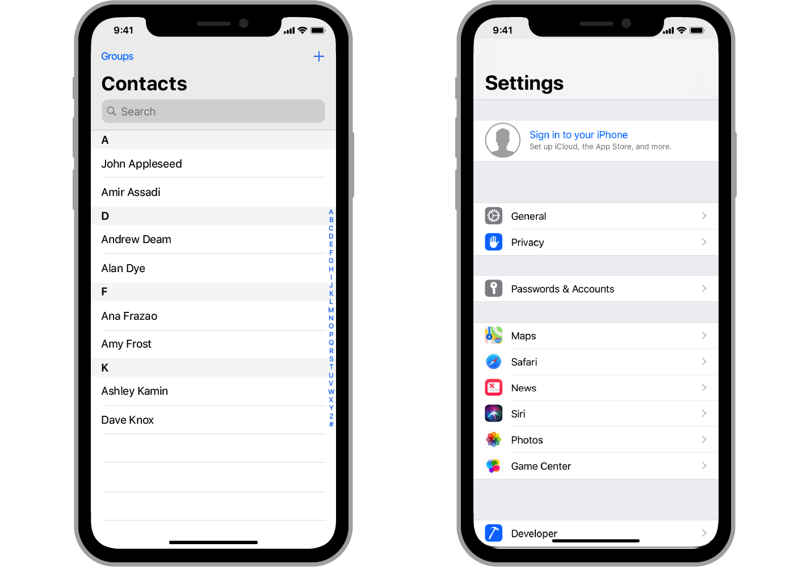
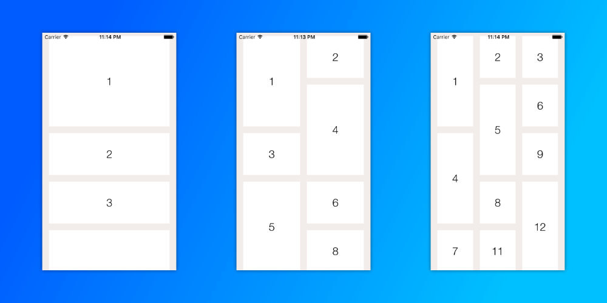
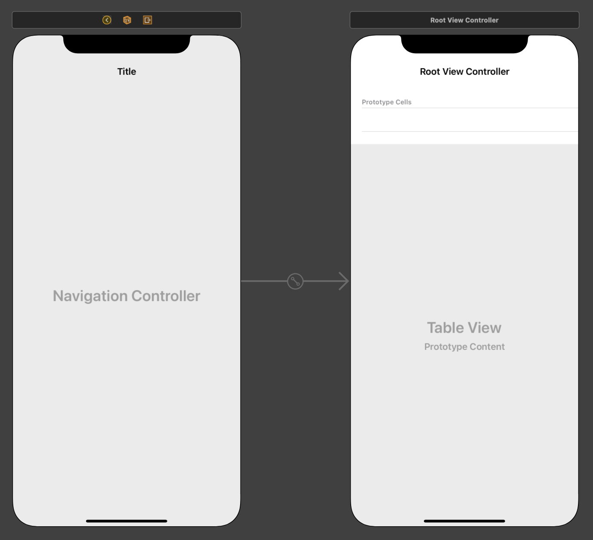
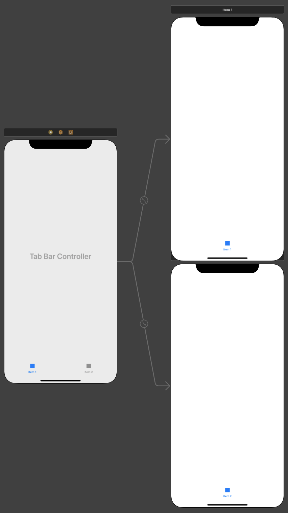

# Controllers

## UIViewController

La classe `UIViewController` définit le comportement partagé qui est commun à tous les contrôleurs de vue.
Les principales responsabilités d'un contrôleur de vues sont les suivantes :
* Mettre à jour le contenu des vues, généralement en réponse à des modifications des données sous-jacentes.
* Répondre aux interactions des utilisateurs avec les vues.
* Redimensionner les vues et gérer la disposition de l'interface globale.
* Coordination avec d'autres objets - y compris d'autres contrôleurs de vues - dans votre application.

### Cycle de vie

```swift
import UIKit

class ViewController: UIViewController {

    override func viewDidLoad() {
        super.viewDidLoad()
        // Do any additional setup after loading the view.
    }

    override func viewWillAppear(_ animated: Bool) {
        super.viewWillAppear(animated)
    }
    
    override func viewDidAppear(_ animated: Bool) {
        super.viewDidAppear(animated)
    }
    
    override func viewWillDisappear(_ animated: Bool) {
        super.viewWillDisappear(animated)
    }
    
    override func viewDidDisappear(_ animated: Bool) {
        super.viewDidDisappear(animated)
    }

}
```

## UITableViewController

La class `UITableViewController` hérite directement de `UIViewController`. Cette classe permet de créer un controleur de vue au format d'une liste scrollable. Le `UITableViewController` implémente également deux protocole, `UITableViewDelegate` et `UITableViewDataSource`. Le protocole `UITableViewDataSource` permet de gérer les données et de fournir des cellules pour la vue. Le protocol `UITableViewDelegate`permet la gestion des sélections, la configuration des `Headers` et `Footers`, la suppression et la réorganisation des cellules, et l'exécution d'autres actions dans la vue.



```swift
import UIKit

class TableViewController: UITableViewController {

    override func viewDidLoad() {
        super.viewDidLoad()

    }

    // MARK: - Table view data source
    override func numberOfSections(in tableView: UITableView) -> Int {
        // #warning Incomplete implementation, return the number of sections
        return 0
    }

    override func tableView(_ tableView: UITableView, numberOfRowsInSection section: Int) -> Int {
        // #warning Incomplete implementation, return the number of rows
        return 0
    }

    override func tableView(_ tableView: UITableView, cellForRowAt indexPath: IndexPath) -> UITableViewCell {
        let cell = tableView.dequeueReusableCell(withIdentifier: "reuseIdentifier", for: indexPath)

        // Configure the cell...

        return cell
    }

    // Override to support conditional editing of the table view.
    override func tableView(_ tableView: UITableView, canEditRowAt indexPath: IndexPath) -> Bool {
        // Return false if you do not want the specified item to be editable.
        return true
    }

    // Override to support editing the table view.
    override func tableView(_ tableView: UITableView, commit editingStyle: UITableViewCell.EditingStyle, forRowAt indexPath: IndexPath) {
        if editingStyle == .delete {
            // Delete the row from the data source
            tableView.deleteRows(at: [indexPath], with: .fade)
        } else if editingStyle == .insert {
            // Create a new instance of the appropriate class, insert it into the array, and add a new row to the table view
        }    
    }

    // Override to support rearranging the table view.
    override func tableView(_ tableView: UITableView, moveRowAt fromIndexPath: IndexPath, to: IndexPath) {

    }

    // Override to support conditional rearranging of the table view.
    override func tableView(_ tableView: UITableView, canMoveRowAt indexPath: IndexPath) -> Bool {
        // Return false if you do not want the item to be re-orderable.
        return true
    }

}
```

## UICollectionViewController

La classe `UICollectionViewController`fonctionne quasiment de la même façon que celle de l'`UITableViewController`, elle comporte également deux protocoles ayant le même rôle que vu précédement, `UICollectionViewDataSource` et `UICollectionViewDelegate`. Ce contrôleur de vue permet la création de liste scrollable verticale ou horizontale avec la possibilité d'affichage en grille.



```swift
import UIKit

private let reuseIdentifier = "Cell"

class CollectionViewController: UICollectionViewController {

    override func viewDidLoad() {
        super.viewDidLoad()

        // Uncomment the following line to preserve selection between presentations
        // self.clearsSelectionOnViewWillAppear = false

        // Register cell classes
        self.collectionView!.register(UICollectionViewCell.self, forCellWithReuseIdentifier: reuseIdentifier)

        // Do any additional setup after loading the view.
    }

    // MARK: UICollectionViewDataSource

    override func numberOfSections(in collectionView: UICollectionView) -> Int {
        // #warning Incomplete implementation, return the number of sections
        return 0
    }


    override func collectionView(_ collectionView: UICollectionView, numberOfItemsInSection section: Int) -> Int {
        // #warning Incomplete implementation, return the number of items
        return 0
    }

    override func collectionView(_ collectionView: UICollectionView, cellForItemAt indexPath: IndexPath) -> UICollectionViewCell {
        let cell = collectionView.dequeueReusableCell(withReuseIdentifier: reuseIdentifier, for: indexPath)
    
        // Configure the cell
    
        return cell
    }

    // MARK: UICollectionViewDelegate

    // Uncomment this method to specify if the specified item should be highlighted during tracking
    override func collectionView(_ collectionView: UICollectionView, shouldHighlightItemAt indexPath: IndexPath) -> Bool {
        return true
    }

    // Uncomment this method to specify if the specified item should be selected
    override func collectionView(_ collectionView: UICollectionView, shouldSelectItemAt indexPath: IndexPath) -> Bool {
        return true
    }

    // Uncomment these methods to specify if an action menu should be displayed for the specified item, and react to actions performed on the item
    override func collectionView(_ collectionView: UICollectionView, shouldShowMenuForItemAt indexPath: IndexPath) -> Bool {
        return false
    }

    override func collectionView(_ collectionView: UICollectionView, canPerformAction action: Selector, forItemAt indexPath: IndexPath, withSender sender: Any?) -> Bool {
        return false
    }

    override func collectionView(_ collectionView: UICollectionView, performAction action: Selector, forItemAt indexPath: IndexPath, withSender sender: Any?) {
    
    }

}
```

## UINavigationController

Un `UINavigationController` est un contrôleur de vue qui contient un ou plusieurs `ViewController` enfants dans une interface de navigation. Dans ce type d'interface, un seul `ViewController` enfant est visible à la fois. La sélection d'un élément dans le `ViewController` pousse un nouveau `ViewController` à l'écran à l'aide d'une animation, masquant ainsi le `ViewController` précédent. Le fait d'appuyer sur le bouton "Retour" de la barre de navigation située en haut de l'interface supprime le `ViewController` supérieur, révélant ainsi le `ViewController` situé en dessous.



```swift
let navigationController = UINavigationController(rootViewController: UIViewController())
```

## UITabBarController

Un `UITabBarController` affiche des onglets en bas de la fenêtre. Chaque onglet est sélectionable afin d'afficher les `ViewController`associé.



```swift
import UIKit

class TabBarController: UITabBarController, UITabBarControllerDelegate {
    
    override func viewDidLoad() {
        super.viewDidLoad()
        //Assign self for delegate for that ViewController can respond to UITabBarControllerDelegate methods
        self.delegate = self
        
    }
    
    override func viewWillAppear(_ animated: Bool) {
        super.viewWillAppear(animated)
        
        // Create Tab one
        let tabOne = UIViewController()
        let tabOneBarItem = UITabBarItem(title: "Tab 1", image: UIImage(named: "defaultImage.png"), selectedImage: UIImage(named: "selectedImage.png"))
        
        tabOne.tabBarItem = tabOneBarItem
        
        
        // Create Tab two
        let tabTwo = UIViewController()
        let tabTwoBarItem2 = UITabBarItem(title: "Tab 2", image: UIImage(named: "defaultImage2.png"), selectedImage: UIImage(named: "selectedImage2.png"))
        
        tabTwo.tabBarItem = tabTwoBarItem2
        
        
        self.viewControllers = [tabOne, tabTwo]
    }
    
    // UITabBarControllerDelegate method
    func tabBarController(_ tabBarController: UITabBarController, didSelect viewController: UIViewController) {
        print("Selected \(viewController.title!)")
    }
}
```
