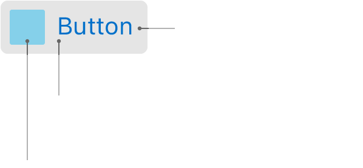

# Views

## UIView
Les vues sont les éléments fondamentaux de l'interface utilisateur de votre application, et la classe `UIView` définit les comportements communs à toutes les vues. La classe `UIView` est une classe concrète que vous pouvez instancier et utiliser pour afficher une couleur de fond fixe. Vous pouvez également en hériter pour dessiner un contenu plus sophistiqué. Pour afficher des labels, des images, des boutons et d'autres éléments d'interface couramment utilisés dans les applications, utilisez les sous-classes de vues fournies par le framework UIKit plutôt que d'essayer de définir les vôtres.

Les `UIView` étant le principal moyen d'interaction de votre application avec l'utilisateur. Ils ont un certain nombre de responsabilités comme, les dessins et animations, la gestion de la mise en page et des sous-vues,
 le traitement des événements... (`UIResponder`)

```swift
let rect = CGRect(x: 10, y: 10, width: 100, height: 100)
let myView = UIView(frame: rect)
```

## UIButton
Les `UIButton`sont comme leur nom indique, des boutons. ils permetent d'ajouter un contrôle qui exécute votre code en réponse aux interactions de l'utilisateur. Lorsque vous ajoutez un bouton à votre interface, vous pouvez définir le type du bouton au moment de sa création, fournir un titre ou une image, dimensionner le bouton en fonction de votre contenu, relier une ou plusieurs méthodes d'action au bouton.



```swift
let button = UIButton(frame: CGRect(x: 20, y: 20, width: 200, height: 60))
button.setTitle("Email", for: .normal)
button.backgroundColor = .white
button.setTitleColor(UIColor.black, for: .normal)
button.addTarget(self, action: #selector(self.buttonTapped), for: .touchUpInside)
```

## UILabel
l'`UILabel` est une vue qui affiche une ou plusieurs lignes de texte. Vous pouvez complètement customiser les labels afin de les intégrer dans votre interface.
```swift
let label = UILabel()
label.text = "EII2022"
```
